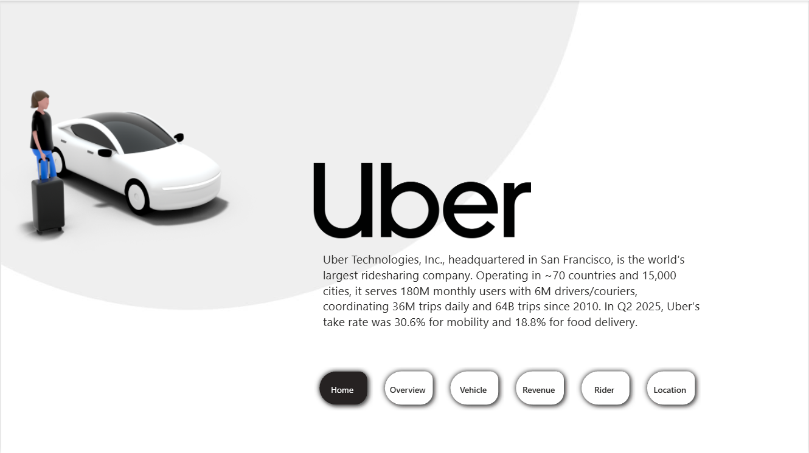

# 🚕 Uber Real-World Data Analysis & Performance Dashboard (Power BI)

An end-to-end **Power BI analytics project** that transforms raw Uber trip data into **actionable business insights** using **Power Query, DAX, data modeling, and interactive dashboards**.

This project analyzes **bookings, revenue, customer behavior, vehicle performance, and demand patterns** to support data-driven business decisions.

---

## 📁 Project Structure

```text
├── data/        # Raw and cleaned Uber datasets
├── images/      # Dashboard screenshots & visuals
│   ├── Home.png
│   ├── Overview.png
│   ├── revenue.png
│   ├── rider.png
│   ├── Location.png
├── reports/     # Power BI (.pbix) file
├── docs/        # Supporting documentation
├── README.md
└── LICENSE

## 📊 Key Highlights

- ✅ End-to-end data cleaning & transformation using Power Query  
- ✅ Star schema data modeling for scalable analytics  
- ✅ KPI tracking: Bookings, Revenue, Trip Distance, Cancellations  
- ✅ Customer segmentation & vehicle contribution analysis  
- ✅ Multi-page interactive Power BI dashboard  
- ✅ Business insights for revenue growth & operational efficiency  

---

## 🛠 Tools & Skills Used

### 🔹 Tools
- Power BI Desktop  
- Power Query  
- Microsoft Excel  

### 🔹 DAX Functions
- CALCULATE  
- SUMMARIZE  
- DISTINCTCOUNT  
- ALL  
- DIVIDE  
- SWITCH  
- FORMAT  

### 🔹 Power BI Features
- Star Schema Modeling  
- Bookmarks  
- Field Parameters  
- Custom Slicers  
- Heat Maps  
- Sparklines  

---

## 🔄 Data Transformation & Modeling

- Cleaned and transformed raw Uber trip data using **Power Query**, handling missing values, fixing headers, and standardizing formats.
- Ensured **data integrity** by manually correcting data types (Booking Value, Distance) to avoid calculation errors.
- Created a **custom Calendar table using DAX (SUMMARIZE)** for time-intelligence analysis.
- Designed a **star schema data model**, linking fact tables with calendar and image metadata tables.

---

## 📈 Advanced DAX & Analysis

- Built core **KPIs** including:
  - Total Bookings (Distinct Count)
  - Completed vs Lost Bookings
  - Total Revenue
  - Average Trip Distance
- Implemented **customer segmentation** (First-time, Return, Regular riders) using advanced DAX logic.
- Performed **vehicle-wise contribution analysis** to identify top revenue-generating services.
- Created **time-slot analysis** to identify peak demand hours.

---

## 📊 Dashboard Design & Visualizations

- Designed a **4-page interactive Power BI dashboard**:
  - Overview (KPIs)
  - Vehicle Performance
  - Revenue Analysis
  - Rider & Location Insights
- Enhanced UX with a **hide/show filter panel** using **Bookmarks and Selection Pane**.
- Integrated **Field Parameters** for dynamic Month/Quarter analysis.
- Built advanced visuals:
  - Heat maps (weekday vs time-slot demand)
  - Sparklines (month-over-month trends)
  - Image-based slicers using web URLs for vehicle identification

---

## 💡 Business Insights Delivered

- Identified **Auto** as the highest revenue-generating vehicle category.
- Found **UPI** as the most preferred payment method among users.
- Analyzed **lost bookings and cancellation reasons** to support churn reduction strategies.
- Highlighted **Khandsa and Badapur** as top pickup locations for strategic vehicle deployment.

---

## 👀 How to View the Project

1. Download the Power BI file from the `reports/` folder  
2. Open it using **Power BI Desktop**  
3. Use slicers and filters to explore:
   - Date  
   - Vehicle Category  
   - Location  
   - Time Slots  
4. Interact with dashboards and drill-down insights

---

## 🖼 Screenshots

### Dashboard Overview


### Vehicle Analysis


### Revenue & Demand Trends

